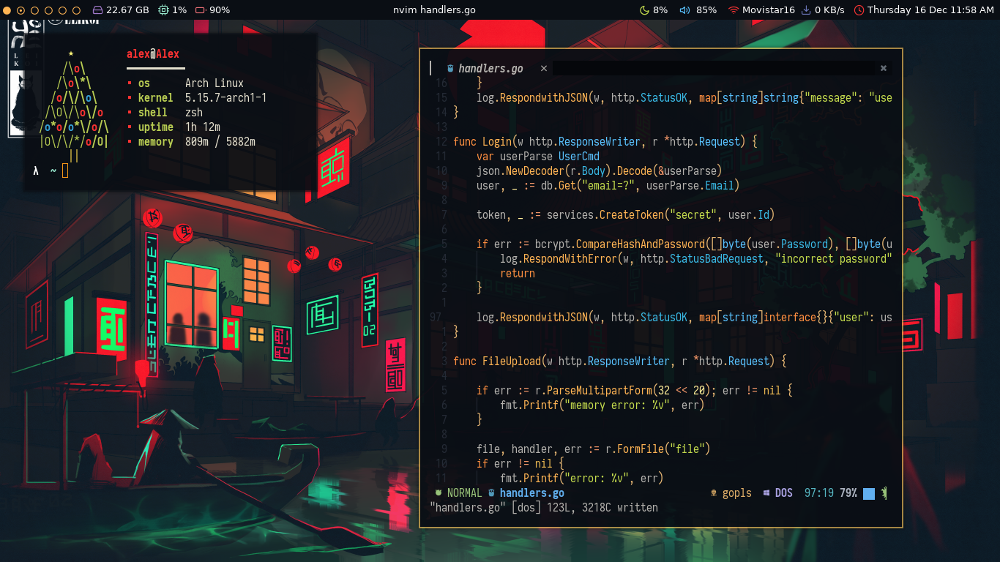
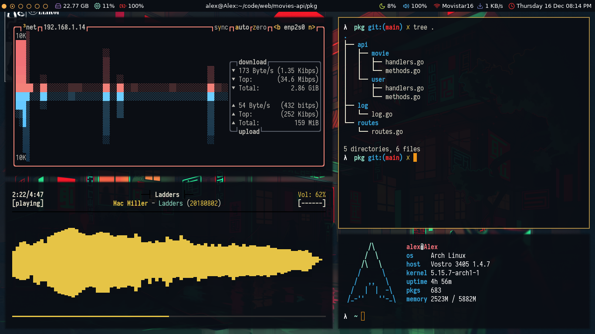

# Dotfiles

My personal configurations for Arch Linux and bspwm.

## Sytem

 | Component            | Description |
 | -------------------- | ----------- |
 | Window manager       | bspwm       |
 | Statubar             | polybar     |
 | Application launcher | rofi        |
 | Terminal             | Kitty       |
 | Shell                | zsh         |
 | Editor               | neovim      |

## Screenshots

    
    

