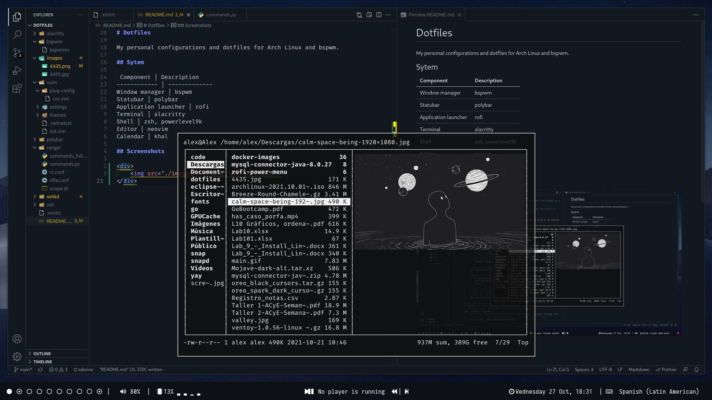
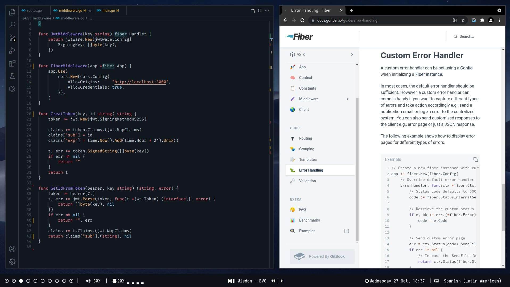

# Dotfiles

My personal configurations for Arch Linux and bspwm.

## Sytem

 Component | Description
------------ | -------------
Window manager | bspwm
Statubar | polybar
Application launcher | rofi
Terminal | alacritty
Shell | zsh, powerlevel9k
Editor | vscode
Calendar | khal

## Screenshots

    
    

